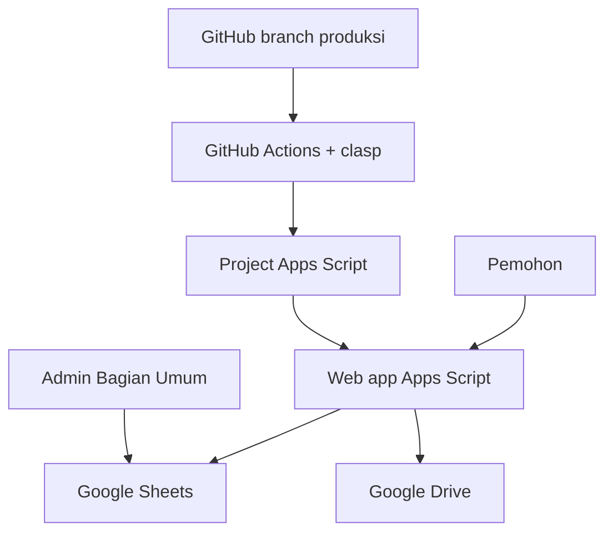
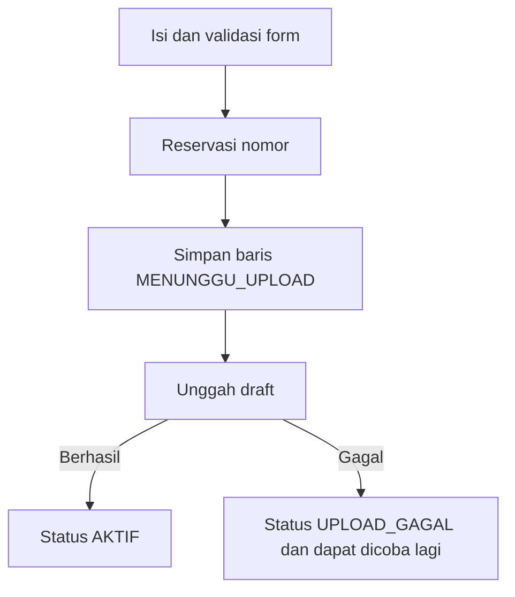
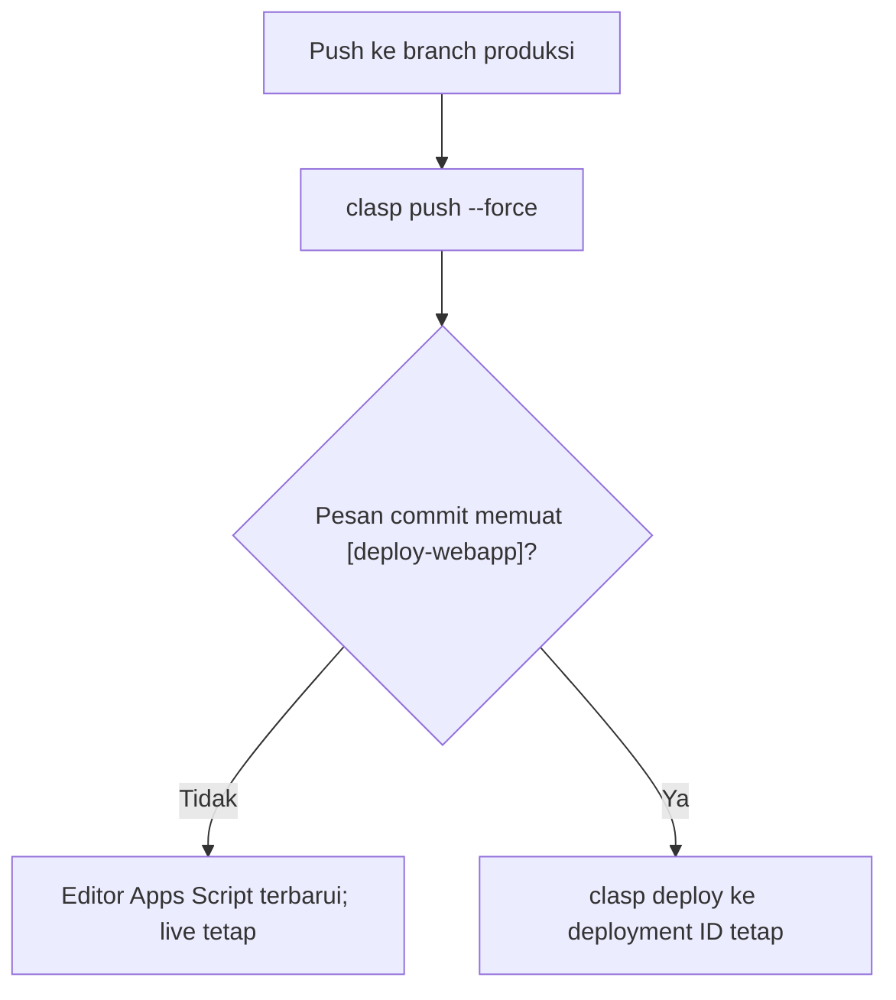

# Handover Sistem Penomoran Surat Otomatis

> Dokumen induk teknis dan operasional untuk pemeliharaan, pengembangan lanjutan, audit, serta serah terima aplikasi Google Apps Script + Google Sheets milik Bagian Umum UIN Sunan Ampel Surabaya.

## 1. Ringkasan status

| Item | Kondisi saat verifikasi |
|---|---|
| Tanggal verifikasi | 25 September 2026 |
| Zona waktu aplikasi | `Asia/Jakarta` |
| Repository | `fathonydnm-byte/sistem-penomoran-otomatis` |
| Branch produksi | `claude/audit-surat-dinas-system-p9saof` |
| Revisi kode live | `66c521bd26dc2bb165eea9693d6415db3c2e5a51` |
| Pesan revisi live | `[deploy-webapp] Aktifkan revisi tanggal permintaan mundur` |
| GitHub Actions deployment | Run `35438555388`, seluruh langkah berhasil |
| Pengujian lokal | 12/12 skenario lulus; JavaScript klien valid |
| Status sinkronisasi | Berkas aplikasi di GitHub identik dengan sumber yang dikirim dan dideploy oleh workflow tersebut |

Commit dokumentasi setelah revisi live tidak mengubah kode aplikasi. Berkas Markdown, dokumentasi, tes, dan konfigurasi GitHub dikecualikan dari `clasp push` oleh `.claspignore`.

## 2. Tujuan aplikasi

Aplikasi menerbitkan nomor surat otomatis bagi pemohon Kantor Pusat UIN Sunan Ampel Surabaya, menyimpan metadata permohonan di Google Sheets, serta mengarsipkan draft surat ke Google Drive.

Jenis nomor yang dikelola:

1. `Surat Dinas`
2. `Nota Dinas`
3. `SK/SE` — SK dan SE menggunakan satu counter bersama

Sistem mendukung:

- permintaan nomor untuk tanggal hari ini;
- permintaan nomor tanggal sebelumnya dari slot reservasi;
- pengajuan individual;
- pengajuan massal dengan gerbang akses khusus;
- unggah draft dengan retry dan pemulihan;
- pencatatan audit permintaan serta perubahan admin;
- migrasi slot lama yang ditandai `Slot Kosong`;
- arsip tahunan otomatis.

## 3. Lokasi dan identitas sistem

| Komponen | Identitas |
|---|---|
| GitHub | <https://github.com/fathonydnm-byte/sistem-penomoran-otomatis> |
| Apps Script project ID | `1a105dbVLfTVRwogvyvA4TIk5QmZnBLmUVnk1SoUxCBU_KEHmg28tv29_` |
| Spreadsheet ID | `1C-u9r4440ZDprkcZMSnjbjki-FoVEF99DmwJmUZpjXs` |
| Folder Drive induk | `1KF7Ak9xReV8MvLmtzMd855tihVi0XBlB` |
| Deployment ID | `AKfycbz4i88ZxnpnlvDV2bgBH3eebT2m7tAHMRo_vCJOurG1BF6HTzT28dXXss3A97gMp-DH` |
| URL web app | <https://script.google.com/macros/s/AKfycbz4i88ZxnpnlvDV2bgBH3eebT2m7tAHMRo_vCJOurG1BF6HTzT28dXXss3A97gMp-DH/exec> |
| Akun admin/deployer | `bag.umum@uinsa.ac.id` |

ID di atas bukan kredensial rahasia, tetapi perubahan terhadap project, spreadsheet, folder, atau deployment harus dilakukan secara terkontrol. Jangan menaruh token OAuth, isi `.clasprc.json`, kode akses massal, atau secret GitHub ke repository.

## 4. Arsitektur



Google Sheets adalah sumber data utama. Drive menyimpan draft. Apps Script menangani validasi, nomor, lock, upload, menu admin, trigger, dan halaman pengguna. GitHub adalah sumber versi kode yang dapat ditelusuri.

## 5. Struktur source code

| Berkas | Tanggung jawab utama |
|---|---|
| `Code.js` | Konfigurasi inti, web app, permintaan individual, counter, upload, validasi, spreadsheet dan Drive |
| `Index.html` | Seluruh antarmuka pengguna, form normal/backdate/massal, loading dan progress upload |
| `Bulk.js` | Autentikasi mode massal, reservasi rentang nomor dan utilitas massal |
| `Reservations.js` | Reservasi harian, hari kerja/libur, nomor mundur, migrasi slot lama dan log permintaan |
| `Admin.js` | Edit, pembatalan, token admin dan audit perubahan |
| `Archive.js` | Arsip tahunan manual/otomatis serta notifikasi |
| `EditDialog.html` | Dialog edit baris terpilih dari Google Sheets |
| `appsscript.json` | Manifest Apps Script, runtime, timezone dan akses web app |
| `.github/workflows/clasp-push.yml` | Sinkronisasi GitHub ke Apps Script dan deployment bersyarat |
| `.claspignore` | Mencegah dokumen, tes dan workflow terkirim sebagai source Apps Script |
| `tests/reservations.cjs` | Regresi logika reservasi dan parsing JavaScript klien |
| `docs/reservasi-harian.md` | Dokumen implementasi khusus fitur reservasi |

## 6. Model nomor dan counter

Counter disimpan di sheet `PENGATURAN`.

| Jenis | Kunci counter | Folder | Kode file | Dari/Kepada |
|---|---|---|---|---|
| Surat Dinas | `NEXT_SURAT_DINAS` | `Surat Dinas` | `SD` | Wajib |
| Nota Dinas | `NEXT_NOTA_DINAS` | `Nota Dinas` | `ND` | Wajib |
| SK/SE | `NEXT_SK_SE` | `SK-SE` | `SK-SE` | Tidak digunakan |

Snapshot counter saat verifikasi 25 September 2026:

| Kunci | Nilai |
|---|---:|
| `COUNTER_YEAR` | 2026 |
| `NEXT_SURAT_DINAS` | 2101 |
| `NEXT_NOTA_DINAS` | 1045 |
| `NEXT_SK_SE` | 952 |

Nilai di atas adalah snapshot, bukan angka statis. Counter akan terus berubah saat nomor diterbitkan. Pada pergantian tahun, counter tahun baru diinisialisasi kembali dari 1 oleh logika aplikasi.

Nomor hanya berupa bilangan untuk setiap kategori dan tahun. Nomor yang sudah dialokasikan tidak boleh dipakai ulang, termasuk jika upload draft gagal atau permintaan dibatalkan.

## 7. Alur permintaan individual



Nomor diterbitkan sebelum file diunggah. Keputusan ini disengaja agar sesi upload yang lambat tidak memegang lock counter. Konsekuensinya, kegagalan upload tidak membatalkan atau mengembalikan nomor.

Urutan server:

1. Terima dan normalisasi data form.
2. Validasi jenis surat, unit, pemohon, perihal, routing, dan token pengiriman.
3. Ambil `ScriptLock`.
4. Pastikan reservasi harian hari tersebut sudah dibuat.
5. Reset counter bila tahun berubah.
6. Alokasikan nomor dan simpan baris `MENUNGGU_UPLOAD`.
7. Lepaskan lock.
8. Upload file lewat panggilan terpisah.
9. Simpan link/file ID dan ubah status menjadi `AKTIF`.

Token pengiriman membuat proses reservasi idempoten: pengiriman ulang payload yang sama mengembalikan identitas permintaan yang sama, bukan nomor baru.

## 8. Upload draft dan indikator progress

Ketentuan saat ini:

- ukuran maksimal: 10 MB;
- ekstensi: PDF, DOC, DOCX, XLS, XLSX;
- mode individual mencoba upload maksimal 3 kali;
- mode massal mencoba upload maksimal 4 kali per item;
- status `MENGUNGGAH` yang macet dapat dipulihkan setelah 15 menit;
- file orphan yang sudah berhasil masuk Drive dapat dipakai kembali saat penyelarasan status;
- antarmuka menampilkan overlay/progress sehingga pengguna mengetahui proses masih berjalan;
- peringatan `beforeunload` mencegah tab tidak sengaja ditutup saat upload aktif.

Pola nama file:

```text
<tahun>_<kode-jenis>_<nomor>_<nama-pemohon>_<nama-file-asli>
```

Struktur folder:

```text
Folder Induk
└── <Tahun>
    ├── Surat Dinas
    ├── Nota Dinas
    └── SK-SE
```

## 9. Status permintaan

| Status | Makna |
|---|---|
| `SLOT_TERSEDIA` | Nomor dicadangkan dan belum diambil pemohon |
| `MENUNGGU_UPLOAD` | Nomor sudah melekat pada permintaan; file belum aktif |
| `MENGUNGGAH` | Server sedang memproses upload |
| `AKTIF` | Nomor dan draft sudah tersimpan |
| `UPLOAD_GAGAL` | Nomor tetap dipakai; file perlu dicoba lagi |
| `GAGAL` | Kegagalan proses yang dicatat |
| `DIBATALKAN` | Permintaan dibatalkan tanpa mengembalikan nomor |

## 10. Mode permintaan

| Mode | Kegunaan |
|---|---|
| `HARI_INI` | Permintaan individual dari counter berjalan |
| `MUNDUR` | Mengambil slot reservasi berdasarkan tanggal dan jenis |
| `MASSAL` | Reservasi beberapa nomor berurutan untuk data bersama |
| `RESERVASI` | Placeholder reservasi, baik hasil alokasi harian maupun migrasi slot lama; asalnya dibedakan pada ledger |

Nama mode aktual mengikuti nilai yang ditulis source. Saat menambah mode baru, perbarui dokumentasi, validasi, audit log, dan pengujian.

## 11. Reservasi nomor harian

Tujuan fitur ini adalah menyediakan nomor untuk permintaan surat bertanggal sebelumnya tanpa mengubah tanggal surat menjadi tanggal pengajuan aktual.

Konfigurasi live saat verifikasi:

| Parameter | Nilai |
|---|---|
| Aktif | Ya |
| Mulai tanggal | 19 September 2026 |
| Surat Dinas | 4 slot per hari kerja |
| Nota Dinas | 4 slot per hari kerja |
| SK/SE | 4 slot per hari kerja |
| Kalender terverifikasi | 2026, 2027 |

Aturan penting:

- slot dibuat hanya untuk hari kerja;
- Sabtu, Minggu, dan tanggal pada `HARI_LIBUR` tidak mendapat slot;
- cuti bersama tetap dianggap hari kerja kecuali sengaja dimasukkan ke `HARI_LIBUR`;
- jumlah slot dapat diubah admin antara 0–100 per kategori;
- tidak ada pembuatan slot retroaktif otomatis sebelum tanggal aktivasi;
- trigger berjalan setiap menit agar segera menangkap pergantian tanggal WIB;
- eksekusi idempoten sehingga pemanggilan berulang tidak menggandakan slot;
- rencana alokasi pending disimpan pada Script Properties supaya proses yang terputus dapat dilanjutkan;
- counter dinaikkan lebih dahulu sebelum placeholder dimaterialisasi untuk mencegah nomor ganda.

Contoh: bila 4 slot hari ini adalah 41–44, permintaan reguler berikutnya dimulai dari 45. Jika nomor aktual terakhir hari ini 60, reservasi besok dimulai 61–64.

## 12. Permintaan nomor tanggal sebelumnya

Alur pengguna:

1. Buka panel `Permintaan Nomor Tanggal Sebelumnya` pada halaman yang sama.
2. Pilih jenis surat.
3. Pilih tanggal sebelum hari ini.
4. Klik `Cek Ketersediaan`.
5. Lengkapi data permohonan.
6. Sistem mengambil nomor terkecil yang masih tersedia untuk kombinasi tanggal + jenis.

Aturan:

- tidak memerlukan persetujuan admin;
- terbuka untuk seluruh pemohon;
- hanya tanggal sebelum hari ini yang diperbolehkan;
- nomor harus berasal dari slot persis pada tanggal dan jenis yang dipilih;
- slot tetap tersedia tanpa batas waktu selama belum diambil;
- jika habis, pengguna diminta memilih tanggal lain atau menghubungi admin;
- `Tanggal Surat` tetap tanggal mundur yang dipilih;
- `Waktu Pengajuan Aktual` tetap waktu pengguna benar-benar mengajukan;
- tanggal di halaman hasil ditampilkan `dd/MM/yyyy`;
- nomor yang sudah diambil tidak kembali ke pool meskipun upload gagal.

Pemisahan `Tanggal Surat` dan `Waktu Pengajuan Aktual` wajib dipertahankan. Menggabungkan keduanya akan membuat nomor lama tampak seolah diterbitkan pada hari pengajuan.

## 13. Migrasi slot lama `Slot Kosong`

Perihal `Slot Kosong` adalah penanda otoritatif untuk data lama. Sistem pemetaan:

1. Memindai semua baris `PERMINTAAN` dengan perihal `Slot Kosong` secara case-insensitive.
2. Menampilkan kandidat pada `TINJAU_SLOT_LAMA`.
3. Admin meninjau/menyetujui.
4. Sistem membuat backup sebelum impor.
5. Slot yang disetujui dimasukkan ke indeks reservasi dan tetap merujuk tanggal/jenis/nomor asal.

Migrasi awal pada 19 September 2026 memetakan 278 slot:

| Jenis | Jumlah |
|---|---:|
| Surat Dinas | 94 |
| Nota Dinas | 101 |
| SK/SE | 83 |
| Total | 278 |

Rentang tanggal slot lama: 31 Juli 2026 sampai 17 September 2026. Backup historis berada di sheet tersembunyi `CADANGAN_PERMINTAAN_SEBELUM_IMPOR_SLOT_20260919`.

Jangan menghapus backup atau sheet tinjauan tanpa salinan eksternal dan persetujuan admin.

## 14. Mode massal

Mode massal disembunyikan dari alur utama agar pengguna umum tidak bingung. Akses memakai kode yang disimpan pada `PENGATURAN`.

Keamanan dan perilaku:

- kode diverifikasi di server dengan perbandingan constant-time;
- kode yang benar menghasilkan token HMAC berlaku 2 jam;
- batas default/live: 100 item per batch;
- nomor dialokasikan sebagai rentang berurutan dalam satu lock;
- semua baris ditulis dalam satu operasi batch;
- upload dilakukan satu per satu agar stabil terhadap batas Apps Script/browser;
- setiap item memiliki status, spinner, dan tombol coba lagi;
- item yang gagal upload tidak membatalkan item lain dan nomornya tetap terpakai.

Kode akses massal sengaja tidak dicatat di dokumen ini. Admin dapat menggantinya dari `PENGATURAN` tanpa perubahan source code.

## 15. Skema Google Sheets

### 15.1 `PERMINTAAN`

| Kolom | Header | Fungsi |
|---:|---|---|
| A | Tanggal dan Waktu Surat | Waktu/tanggal surat historis; kompatibilitas data lama |
| B | Nomor Surat | Nomor numerik |
| C | Jenis Surat | Surat Dinas, Nota Dinas, atau SK/SE |
| D | Perihal | Detail surat; `Slot Kosong` untuk placeholder lama |
| E | Dari | Pejabat/unit pengirim |
| F | Kepada | Tujuan surat |
| G | Nama Pemohon | Nama pengaju |
| H | Unit Kerja | Unit pengaju |
| I | Email Terdeteksi | Opsional; dapat kosong pada akses anonim |
| J | Link Alih Media | URL draft di Drive |
| K | Status | Status siklus permintaan |
| L | ID Permintaan | UUID atau ID slot unik |
| M | Tahun | Tahun nomor |
| N | Nama File Asli | Nama file sebelum dinormalisasi |
| O | ID File Drive | ID file hasil upload |
| P | Token Pengiriman | Idempotency token |
| Q | Kunci Pengguna Sementara | Pengikat sesi/pengguna sementara |
| R | Diperbarui Pada | Waktu perubahan terakhir |
| S | Tanggal Surat | Tanggal surat khusus, format `dd/MM/yyyy` |
| T | Mode Permintaan | Hari ini, mundur, massal, reservasi, atau migrasi |
| U | Waktu Pengajuan Aktual | Timestamp pengajuan sebenarnya |

`PERMINTAAN` adalah sumber kebenaran untuk ketersediaan dan penggunaan nomor.

### 15.2 `PENGATURAN`

Kunci utama:

- `COUNTER_YEAR`
- `NEXT_SURAT_DINAS`
- `NEXT_NOTA_DINAS`
- `NEXT_SK_SE`
- `ROOT_FOLDER_ID`
- `TIMEZONE`
- `MAX_FILE_SIZE_MB`
- `ALLOWED_EXTENSIONS`
- `ADMIN_EMAIL`
- `BULK_ACCESS_CODE`
- `BULK_MAX_ITEMS`
- `SCHEMA_VERSION`

Jangan mengubah counter saat permohonan sedang aktif. Catat nilai lama, alasan, waktu, dan nilai baru jika koreksi manual benar-benar diperlukan.

### 15.3 `KONFIGURASI_RESERVASI`

| Kolom | Isi |
|---|---|
| A | Kunci |
| B | Nilai |
| C | Keterangan |

Kunci: `AKTIF`, `MULAI_TANGGAL`, tiga nama jenis surat, dan `TAHUN_KALENDER_DIVERIFIKASI`.

### 15.4 `HARI_LIBUR`

| Kolom | Isi |
|---|---|
| A | Tanggal |
| B | Keterangan Libur Nasional |

Sheet ini harus diisi dan tahun harus ditandai terverifikasi sebelum alokasi tahun bersangkutan diizinkan.

### 15.5 `RESERVASI_NOMOR`

Header:

1. ID Slot
2. Tanggal Surat
3. Jenis Surat
4. Nomor
5. Asal
6. Dibuat Pada
7. ID Permintaan Pemakai
8. Diambil Pada
9. File Placeholder Lama

Sheet ini adalah ledger/audit slot yang tahan lama; status pemakaian tetap dikonfirmasi terhadap `PERMINTAAN`.

### 15.6 `LOG_PERMINTAAN`

Mencatat timestamp kejadian, waktu pengajuan, tanggal surat, jenis, nomor, perihal, dari, kepada, pemohon, unit, email opsional, ID permintaan, mode, dan kejadian.

### 15.7 `LOG_PERUBAHAN`

Mencatat timestamp, ID permintaan, nomor, aksi, kolom, nilai lama, nilai baru, alasan, dan email admin.

### 15.8 Sheet tersembunyi

- `RESERVASI_NOMOR`
- `LOG_PERMINTAAN`
- `HARI_LIBUR`
- `TINJAU_SLOT_LAMA`
- `CADANGAN_PERMINTAAN_SEBELUM_IMPOR_SLOT_20260919`

Sheet dapat ditampilkan saat audit, tetapi jangan diubah langsung tanpa memahami relasinya dengan `PERMINTAAN`.

## 16. Menu admin Google Sheets

Menu `Administrasi Nomor Surat` menyediakan:

1. Edit Permintaan Terpilih
2. Batalkan Permintaan Terpilih
3. Arsipkan Data Tahun Lalu
4. Buka Pengaturan Counter
5. Siapkan Reservasi Harian
6. Aktifkan Reservasi Harian
7. Tinjau Slot Kosong Lama
8. Setujui Semua Slot Lama Siap
9. Impor Slot Lama yang Disetujui
10. Instal / Perbaiki Sistem

Edit admin memakai token HMAC yang terikat pada baris, ID permintaan, dan admin. Perubahan menyimpan nilai lama, nilai baru, alasan, serta email admin. Semua record dapat diedit, termasuk permintaan mundur dan placeholder reservasi. Bila tanggal/jenis/nomor record reservasi berubah, editor menyelaraskan `PERMINTAAN` dan `RESERVASI_NOMOR` di bawah script lock yang sama. ID internal, status, mode, token, dan waktu pengajuan aktual tidak diedit dari dialog umum.

Pembatalan mengubah status tetapi tidak menghapus baris dan tidak mendaur ulang nomor.

## 17. Concurrency, integritas, dan keamanan data

Mekanisme yang harus dipertahankan:

- `LockService.getScriptLock()` untuk semua penulis counter;
- durasi lock sesingkat mungkin;
- upload file dilakukan setelah lock dilepas;
- idempotency token mencegah double submit;
- penyimpanan rencana reservasi pending untuk recovery;
- input teks dibersihkan untuk mencegah formula injection Sheets;
- validasi ulang di server, bukan hanya di browser;
- nomor tidak pernah didaur ulang otomatis;
- `PERMINTAAN` sebagai sumber kebenaran;
- log audit append-only sebisa mungkin.

Web app dijalankan sebagai akun deployer dan dapat diakses `ANYONE_ANONYMOUS`. Karena itu, `Session.getActiveUser().getEmail()` dapat kosong. Email adalah metadata opsional dan tidak boleh dijadikan satu-satunya kontrol keamanan form publik.

## 18. Arsip tahunan

Trigger arsip dipasang bulanan pada tanggal 2 sekitar pukul 02.00 WIB. Apps Script tidak menyediakan trigger tahunan langsung; proses bulanan bersifat idempoten dan hanya memindahkan data tahun sebelumnya.

Tujuan:

- menjaga `PERMINTAAN` dan `LOG_PERUBAHAN` tetap ringan;
- memindahkan data selesai ke `ARSIP_<NAMA_SHEET>_<TAHUN>`;
- mempertahankan data tahun berjalan;
- mempertahankan data lama yang masih pending/reservasi/gagal upload bila masih dibutuhkan operasional;
- mengirim notifikasi hasil atau kegagalan ke admin.

Data yang sudah diarsipkan dianggap historis. Koreksi dilakukan secara manual dan terkontrol pada sheet arsip.

## 19. Deployment GitHub ke Apps Script

Workflow berjalan setiap push ke branch produksi.



Aturan:

- push biasa menyelaraskan source ke editor Apps Script;
- deployment live hanya diperbarui jika pesan commit mengandung `[deploy-webapp]`;
- secret GitHub `CLASP_CREDENTIALS` harus valid;
- deployment menggunakan ID tetap agar URL publik tidak berubah;
- dokumentasi/tes tidak ikut dikirim oleh `.claspignore`.

Revisi live `66c521b` berhasil melewati langkah:

1. Checkout kode
2. Setup Node.js
3. Install clasp
4. Pulihkan kredensial clasp
5. Push ke Apps Script
6. Perbarui deployment web app

## 20. Prosedur perubahan yang disarankan

1. Tarik branch produksi terbaru.
2. Pastikan tidak ada perubahan lokal milik orang lain yang tertimpa.
3. Buat perubahan kecil dan terfokus.
4. Tambahkan/ubah tes bila logika nomor, tanggal, status, atau reservasi berubah.
5. Jalankan:

   ```bash
   node tests/reservations.cjs
   git diff --check
   ```

6. Review diff, khususnya counter, header sheet, status, lock, dan upload.
7. Commit dan push tanpa penanda deploy untuk sinkronisasi source saja.
8. Uji di editor/deployment pengujian bila tersedia.
9. Gunakan `[deploy-webapp]` hanya saat revisi siap live.
10. Periksa GitHub Actions sampai `clasp-push` dan, bila diminta, `Perbarui deployment web app` berstatus sukses.
11. Smoke test halaman publik tanpa membuat nomor percobaan yang tidak perlu.
12. Catat perubahan penting di dokumen ini atau changelog.

## 21. Checklist instalasi atau pemulihan

Gunakan akun admin/deployer yang benar.

1. Pastikan seluruh file source berada pada Apps Script project yang benar.
2. Pastikan `appsscript.json` memakai timezone `Asia/Jakarta`.
3. Buka spreadsheet target.
4. Jalankan menu `Instal / Perbaiki Sistem`.
5. Verifikasi sheet dan header wajib.
6. Verifikasi folder tahun dan jenis surat.
7. Verifikasi nilai counter terhadap nomor terakhir yang sah.
8. Verifikasi `HARI_LIBUR` dan tahun kalender.
9. Verifikasi trigger `runDailyReservations` hanya satu.
10. Verifikasi trigger `runScheduledArchive_` hanya satu.
11. Verifikasi URL web app memakai deployment ID yang benar.
12. Uji satu permintaan pada lingkungan aman atau dengan prosedur pembatalan tercatat.

`initializeApplication()` bersifat idempoten dan tidak menimpa counter yang sudah ada.

## 22. Troubleshooting

### Upload berhenti di `Draft sedang diunggah`

1. Jangan membuat nomor baru.
2. Tunggu retry otomatis selesai.
3. Gunakan tombol coba lagi pada permintaan yang sama.
4. Periksa status baris dan `ID File Drive`.
5. Periksa folder Drive apakah file sudah terbuat.
6. Bila status `MENGUNGGAH` lebih dari 15 menit, mekanisme recovery dapat mengambil alih.
7. Jangan menghapus baris atau mengembalikan counter.

### Nomor mundur tidak tersedia

1. Pastikan tanggal benar-benar sebelum hari ini.
2. Pastikan jenis surat cocok.
3. Cari placeholder tanggal + jenis pada `PERMINTAAN`.
4. Cocokkan ledger `RESERVASI_NOMOR`.
5. Pastikan slot belum memiliki ID pemakai.
6. Periksa apakah semua slot memang sudah terambil.

### Reservasi harian tidak terbentuk

1. Periksa `AKTIF`.
2. Periksa `MULAI_TANGGAL`.
3. Periksa tahun ada di `TAHUN_KALENDER_DIVERIFIKASI`.
4. Periksa hari bukan Sabtu/Minggu/libur nasional.
5. Periksa trigger `runDailyReservations`.
6. Periksa Apps Script Executions dan Script Properties pending/done.
7. Jangan menjalankan koreksi counter sebelum memahami rencana pending.

### Counter melompat

Nomor dapat tampak melompat karena reservasi harian sudah mengambil blok nomor. Cari nomor tersebut pada placeholder `SLOT_TERSEDIA` sebelum menyimpulkan ada data hilang.

### GitHub dan live tampak berbeda

1. Periksa branch produksi.
2. Periksa commit terakhir dan GitHub Actions.
3. Pastikan langkah `Push ke Apps Script` sukses.
4. Pastikan commit yang dimaksud memakai `[deploy-webapp]` jika perubahan harus live.
5. Periksa deployment ID pada workflow.
6. Ingat bahwa push biasa mengubah editor tetapi tidak deployment live.

## 23. Pengujian regresi saat ini

`tests/reservations.cjs` mencakup:

1. 12 slot harian dan idempotensi pemanggilan ulang.
2. Pengecualian akhir pekan/libur nasional dan perlakuan cuti bersama.
3. Tidak ada slot retroaktif sebelum aktivasi.
4. Permintaan normal membuat slot terlebih dahulu lalu mengambil nomor berikutnya.
5. Backdate mengambil nomor terkecil dan token duplikat tidak membuat nomor baru.
6. Slot yang sudah dipakai tidak kembali setelah upload gagal.
7. Penolakan hari ini, masa depan, dan tanggal invalid.
8. Kehabisan slot tidak menaikkan counter.
9. Recovery rencana alokasi setelah write failure.
10. Slot lama tetap dapat dipakai setelah arsip dan tidak mereset counter aktif.
11. Kalender libur yang belum diverifikasi memblokir alokasi.
12. Marker legacy memakai perihal, terlepas dari placeholder routing.

Tes juga memastikan JavaScript pada `Index.html` dapat diparse.

`tests/admin-edit.cjs` menguji akses edit untuk record biasa, permintaan
mundur, dan placeholder reservasi; relasi ledger; penolakan identitas
reservasi ganda; serta parsing JavaScript pada `EditDialog.html`.

## 24. Catatan operasional dan risiko

1. **Versi schema konfigurasi.** Source default saat ini `2.2.0`, sedangkan nilai live `PENGATURAN!SCHEMA_VERSION` terbaca `2.1.1` saat verifikasi. Ini bukan perbedaan source/deployment: `ensureDefaultSettings_()` hanya mengisi kunci yang belum ada dan tidak menimpa nilai lama. Selaraskan secara manual setelah memastikan seluruh migrasi schema 2.2.0 sudah lengkap.
2. **Kalender libur.** Tahun baru harus ditambahkan dan diverifikasi sebelum reservasi tahun itu berjalan.
3. **Ketepatan tengah malam.** Trigger setiap menit berarti reservasi dibuat segera setelah 00.00 WIB, bukan dijamin tepat detik 00:00:00.
4. **Kuota Google.** Upload, Drive, email, trigger, dan execution time tunduk pada kuota akun Google Workspace.
5. **Akses anonim.** Email pemohon mungkin tidak tersedia dan memang diperlakukan opsional.
6. **Header sheet.** Jangan menggeser, mengganti nama, atau menyisipkan kolom di tengah tanpa migrasi source dan data.
7. **Rahasia.** Jangan menaruh `BULK_ACCESS_CODE`, OAuth token, atau isi secret GitHub dalam dokumen/log publik.
8. **Nomor tidak didaur ulang.** Hindari menghapus baris gagal demi “merapikan”; histori tersebut melindungi dari penomoran ganda.

## 25. Riwayat perubahan utama

| Tanggal | Perubahan |
|---|---|
| Sebelum Sep 2026 | Import source, UI, optimasi, admin audit, arsip tahunan, dan mode massal |
| 19 Sep 2026 | Retry upload massal dan perbaikan upload individual/progress |
| 19 Sep 2026 | Reservasi harian configurable dan permintaan nomor mundur |
| 19 Sep 2026 | Optimasi trigger, kalender, recovery, dan impor slot lama |
| 19 Sep 2026 | Pemetaan seluruh perihal `Slot Kosong` |
| 19 Sep 2026 | Format tanggal Indonesia dan pemisahan tanggal surat/waktu pengajuan |
| 19 Sep 2026 | Deployment live revisi backdate dari commit `66c521b` |
| 25 Sep 2026 | Verifikasi ulang sinkronisasi, tes regresi, dan pembuatan dokumen handover ini |
| 30 Sep 2026 | Editor admin dibuka untuk seluruh record dan menyelaraskan perubahan identitas reservasi ke ledger |

## 26. Checklist handover singkat

Orang yang menerima pengelolaan minimal harus memperoleh:

- akses ke repository dan branch produksi;
- akses editor Apps Script;
- akses spreadsheet;
- akses folder Drive induk;
- hak deploy/akun `bag.umum@uinsa.ac.id` atau prosedur penggantinya;
- pemahaman bahwa nomor tidak boleh digunakan ulang;
- prosedur `[deploy-webapp]`;
- prosedur pembaruan hari libur tahunan;
- prosedur backup sebelum perubahan besar;
- lokasi log permintaan, log perubahan, dan arsip.

## 27. Definisi sumber kebenaran

Jika terjadi perbedaan informasi, gunakan urutan berikut:

1. `PERMINTAAN` untuk fakta nomor dan status pemakaian.
2. `RESERVASI_NOMOR` untuk audit asal dan konsumsi slot.
3. GitHub branch produksi untuk source code terkontrol.
4. GitHub Actions untuk bukti sinkronisasi/deployment.
5. Apps Script Executions untuk diagnosis runtime.
6. Google Drive untuk keberadaan file fisik.

Jangan menyimpulkan nomor bebas hanya karena file Drive tidak ditemukan. Keputusan ketersediaan nomor berasal dari data permintaan dan ledger, bukan dari file.

---

Dokumen ini tidak menyimpan kredensial. Saat memperbarui dokumen, gunakan tanggal absolut, commit SHA, dan nomor workflow run agar histori mudah diverifikasi.
